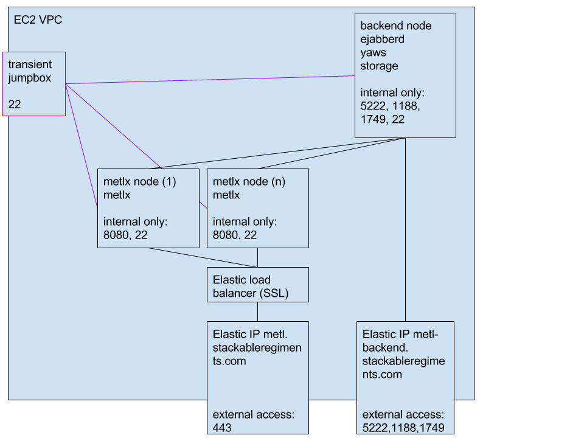

## Content

- [Context](#context) 
- [Exposure Mesh](#exposure-mesh) 
- [Actors](#actors) 
  - [Staff](#staff) 
  - [Students](#students) 
  - [Auditors](#auditors) 
  - [Maintainers](#maintainers) 
- [Information Entities](#information-entities) 
- [Control Capabilities](#control-capabilities) 
  - [TLS 1.2](#tls-12) 
  - [Public / Private Key Authentication](#public--private-key-authentication) 
  - [File Encryption](#file-encryption) 
- [Compliance](#compliance) 
  - [FIPS](#fips) 

## Context

This document describes the security architecture of the centrally hosted MeTL system (from January 2016).

MeTL is a system which connects on and off campus students in a real-time teaching experience. 
It does not traffic in examinable materials.
The teaching materials presented in MeTL are available to the limited audience of students enrolled in the class. 
Assessments done in MeTL are informal and do not contribute to the academic permanent record of a student.

MeTL is deployed in the Amazon Web Services cloud, in the Northwest US region.

## Exposure Mesh

<!-- TODO: update with 2016 architecture -->

The only external facing points in the MeTL AWS architecture are the load balancers and the jumpboxes 
(which are brought up on demand to perform backend administration).
All internal nodes are protected by AWS security groups restricting access to only other nodes within the VPC.

## Actors

### Staff

Staff in the MeTL system are authenticated users.
They may manipulate other people’s content in any conversation they own, and may set conversation mode.
  
### Students

Students in the MeTL system are authenticated users.
They may manipulate other people’s content in any conversation they own, and may set conversation mode.

### Auditors

Auditors in the MeTL system are authenticated users, specifically named in MeTL server configuration.
They are granted superuser powers, which means they behave as though they were the owner of any conversation they enter.

<!-- TODO: confirm
Auditors also have access to the data which is emitted to the SIEM, through that system’s interface.
-->

### Maintainers

Maintainers of the MeTL system are Stackable Regiments users.
They may choose not to have superuser powers, as they have control of that server configuration element.
Maintainers have access to the bastion boxes which are the only means of ingress to the MeTL AWS backend nodes.

## Information Entities

Entity | Confidentiality | Integrity | Rationale
--- | :---: | :---: | ---
Conversation structure | Low | Moderate | A conversation’s structure gives little information other than that the user exists.
Conversation prepared content | Low | High | A conversation’s prepared content is curriculum archived and available to semi-public use.
Conversation contributed content | Moderate | High | Content contributed during a conversation is less considered and is more likely to contain copyrighted or personally identifying information.
Conversation poll structure | Moderate | High | A conversation’s polls, while not examinable, would be disruptive to teaching if discovered in advance.
Conversation poll responses | Low | Moderate | A conversation’s poll responses are restricted to pre-published options and pose little risk of accidental disclosure or disruption.
Domain identities | Low | Critical | The identities within the SLU domain are derived directly from the legal entity’s name of registration and are public record.  They are the correlation token of integration and must be correct.
Domain credentials | Critical | Critical | The credentials to prove the identities within the SLU domain would compromise other systems if breached, with legal and financial consequence.
Class lists | High | Moderate | Information about student allocation enables inference about the student’s real world location.  It is permitted to be eventually consistent, however, in its business usage.

## Control Capabilities

### TLS 1.2

All MeTL HTTPS traffic uses this transport-level cryptographic protocol to prevent network snooping.
The HTTPS traffic are TLS terminated by the Amazon Elastic Load Balancers, which support configurable cipher and 
protocol settings capable of complying with FIPS standards.

### Public / Private Key Authentication

MeTL bastion boxes authenticate with per-user keys to permit shell access.
The keys are not shared between users and are not used for any other purposes.
In the event of credential leakage, the jump boxes can be easily decommissioned and recommissioned with new keys.

<!-- TODO: confirm
This control covers configuration of class lists.
These will be specified as application configuration and placed on the backend filesystem,
having been extracted by SLU and handed over in an encrypted file attached to email.
-->

### File Encryption

Data being transferred manually and through email is encrypted before any handover is made.
An encrypted ZIP is specified at using AES 256 cyphers.
Pre-shared keys for this encryption mechanism are handed over verbally and do not enter email or insecure digital 
space save for entry on user systems.

<!--
This control covers handover of class lists.
-->

## Compliance

### FIPS

This architecture achieves FIPS compliance.
It does not achieve FIPS validation.

To meet FIPS 140-2 validation, we would need to either:
1. move to AWS govCloud, which would necessitate having the customer own the AWS instances and VPC 
(AWS govCloud is validated for FIPS 140-2, but is only accessible to US persons and corporations).
This would not change the architecture, but would change the instance ownership/management relationship, 
shifting the relationship from that of a SaaS provider to a support provider.
2. move away from Amazon ELB in favour of a FIPS validated virtual load balancer running in the Stackable Regiments 
AWS instance.  This would not significantly change either the relationship or the architecture.
It would however, necessitate finding and testing an appropriate load balancer.

To meet FIPS 140-2 compliance, ELBs are configured with the appropriate cipher and protocol to meet current 
FIPS 140-2 recommendations.
